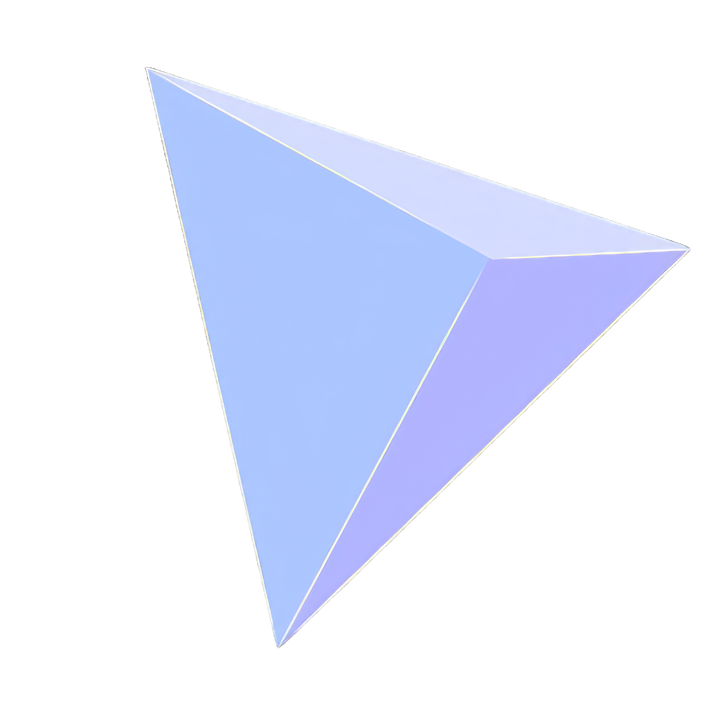
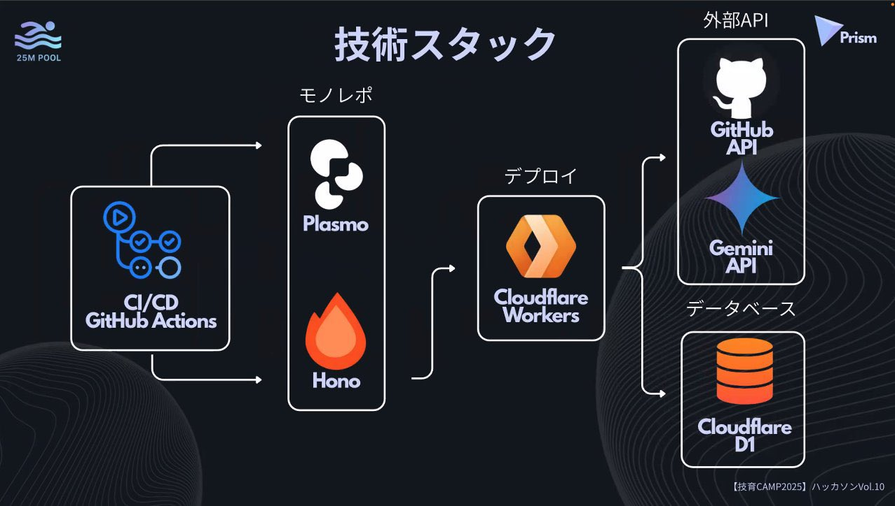

  
  <h1>Prism</h1>
  
チケット自動作成Chrome拡張機能

  <a href="https://x.com/geek_pjt/status/1954475800746733600" target="_blank">受賞ポスト</a> 
  <a href="https://www.canva.com/design/DAGu1IlNKQg/RrZor8eAZUd7bRnOmdlvIw/edit?utm_content=DAGu1IlNKQg&utm_campaign=designshare&utm_medium=link2&utm_source=sharebutton" target="_blank">プレゼン資料</a>

 

  
  
  
  
  
  
  
  
  
  
  

  <h2>Architecture</h2>
  

